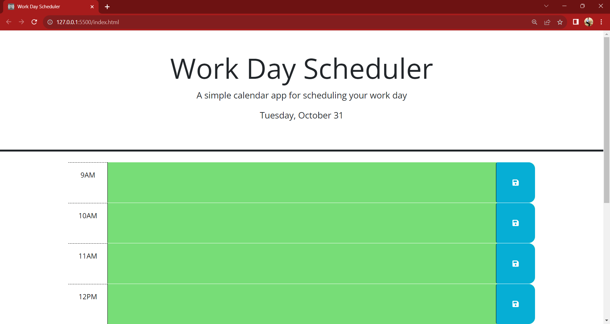

# Work Day Calendar

### Description
Crafted with the intention of aiding personal task management, this workday calendar app is a practical solution designed for organizing and tracking activities within the 9 AM to 5 PM timeframe. The app provides a user-friendly interface to enhance productivity and ensure efficient scheduling of daily tasks.

- My motivation for this project was to further more skills and knowledge by creating another project that solves a problem in my personal life.
- I developed this project to put the skills that I know to use and to get more practice. Also, I wanted to develop something that I can use in real life.
- From this project I learned how to break problems down into smaller problems and solve them one by one.

## This Project does the following
  - Displays the current date and time at the top of the screen.
  - Allows users to type in a task that they have to do at a specific hour from 9AM-5PM
  - Allows users to save those tasks so that data is persistent when the user closes the app.
  - The hours ahead of the current hour will always be highlighted in green. Green inputs lets the user know that the current time has not reached the future times yet in the current day.
  - The previous hours will always be highlighted in gray. Gray inputs mean that those hours have already past in the current day.
  - The current hour will always be highlighted in red. Red inputs mean its the current time.

### Technologies Used
- HTML
- CSS
- Javascript
- Jquery
- Bootstrap

Deployed Site: https://batking74.github.io/Work-Day-Calendar/

GitHub Repository: https://github.com/Batking74/Work-Day-Calendar
